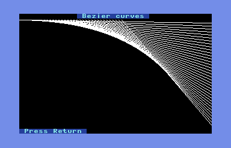

C3L is an ANSI C based API to access C128 specific features under CP/M.
This will eventually replace [SG C Tools](https://github.com/sgjava/garage/tree/master/commodore/cpm/sgctools).
I decided to build a new library from scratch after creating
[C128 CP/M VIC Demo](https://github.com/sgjava/garage/tree/master/commodore/cpm/vicdemo).
I updated my development process doing all development using Eclipse for editing
the source, MyZ80 to build, ctools to move the source to a d71 disk image for
running code on VICE. This is a vast improvement of how I did it back in 1992
when I had to transfer to floppies for testing. I'm starting with the VIC II and
will add other chips and features as I go.

## Set up development environment
You have a few ways to develop C code for C128 CP/M. You could use a cross
compiler, but I haven't found a way to do this with Hitech C 3.09. You could
use MyZ80 which is pretty darn fast or lastly you could use the VICE emulator.
Of course a real C128 system would work, but it will not be as productive as
the above mentioned methods. I've chosen the Eclipse/MyZ80/ctools method
because the flow is easier and build time are fast. You can use an Ubuntu VM
on VirtualBox to run under Linux/Windows/Mac if that works for you.

Build [VICE 3.3](http://vice-emu.sourceforge.net) on Ubuntu 18.04 x64.
* `sudo apt-get install build-essential byacc texi2html flex xa65 libreadline-dev libxaw7-dev libgtkmm-3.0-dev libpulse-dev`
* [Download](http://vice-emu.sourceforge.net/index.html#download) latest VICE source and extract.
* `cd vice-3.x` (use actual directory name)
* `./configure --enable-native-gtk3ui`
* `make`
* `sudo make install`
* `x128 -80col`

Build ctools:
* `git clone https://github.com/mist64/ctools`
* `cd ctools/src`
* `make`
* `make install`

Install [Eclipse](https://linuxize.com/post/how-to-install-the-latest-eclipse-ide-on-ubuntu-18-04/).

## Building
I'm using MyZ80, but you could use VICE or a real C128 with two drives.
Drive a: (1581) boots CP/M and has Hitech C, turbo editor, etc. Drive b: (1571)
contains the source that ctools can write to from your Eclipse src folder. The
[src](https://github.com/sgjava/c3l/tree/master/src) directory should be
considered the latest source. The [disk images](https://github.com/sgjava/c3l/tree/master/disks) may go out of date. To build
latest source from scratch:
* `x128 -80col`
* In VICE configure drives.
* Boot boot.d81 as device 8.
* Attach c3l.d71 as device 9.
* `b`:
* `era *.*`
* Detach device 9.
* Copy eclipse src to disk image. Change paths as needed.
* `~/ctools/bin/ctools ~/cpm/c3l.d71 p ~/eclipse-workspace/c3l/src/*.*`
* Attach c3l.d71 as device 9.
* Build c3l library.
* `submit lib`
* Alt+W (VICE warp mode) and answer prompts.
* Build demos.
* `submit compile`
* Alt+W (VICE warp mode).
* Run a demo.
* `vicdemo1`

## Programming considerations
* No range checks are performed by most functions for performance sake. It is
incumbent upon the programmer to handle range checks. If you go out of range
and corrupt the program or OS memory it will most likely lock the machine.
* If the linker gives an "Undefined symbol" message for some symbol which you know
nothing about, it is possible that it is a library routine which was not found
during the library search due to incorrect library ordering.  In this case you
can search the library twice, e.g. for the standard library add a -LC to the end
of the C command line, or -LF for the floating library.  If you have specified
the library by name simply repeat its name.

## 8564/8566 VIC-IIe



### Features
* Easy to configure VIC mode and memory layout
* 16 bit operations used where possible
* Fast text output (even faster without color)
* Custom character sets (can be copied from VDC or loaded from disk)
* Scroll any area of screen
* Bitmap mode with optimized graphics and text 

### VIC memory management in CP/M
By default CP/M uses the VIC in MMU bank 0. This makes it difficult to access
from your CP/M program because the TPA is in bank 1. You could try to switch
banks like CP/M does, but this is very inefficient. Plus there is very little
free RAM in bank 0 that you could leverage. For C3L programs MMU bank 1 is
used and your program manages the VIC's memory.

You can use [allocVicMem()](https://github.com/sgjava/c3l/blob/be5396dbebb6b99084f3128bf62baf0d6e4c1427/src/vicmem.c#L19)
function to handle reserving memory for the VIC and
protect it from the running program. There are several configurations you can
use based on program size and VIC features you want to use. The simplest
configuration is to have your program and VIC memory in VIC bank 0 with
allocVicMem(0). With this configuration your program can reside from
0x100-0x2fff (almost 8K) and VIC memory is used starting at 0x3000 for character
set and 0x3800 for first screen. 0x1000-0x1fff is viewed by the VIC as
character ROM, but your program can use this memory, so it's not wasted.

allocVicMem() reserves a contiguous block of memory, thus allocVicMem(1) reserves
VIC bank 0 and VIC bank 1. VIC bank 3 is in the gray area since some of it is
reserved for CP/M. It's a good idea to allocate memory in bank 3 manually if
you have a large program. Remember to free() memory allocated by allocVicMem()
when you are done with the VIC.

### Return to CP/M mode
You should return to CP/M like nothing happened to the VIC. Color memory is restored
when you exit back to CP/M, so no code is required for that. To restore VIC for CP/M
use:

```
/* CPM default */
setVicChrMode(0, 0, 11, 3);
```

### Limitations
As I mentioned before 0x1000 is always read by the VIC as character ROM. You can
still read and write to the memory with your program. You could store extra
character sets, sprites, etc. there and copy them as needed for example.

Sprites flicker and cause characters on the screen to flicker too. I'm not sure
if this is VICE or if it would happen on a real C128.

## DS12C887 Real Time Clock

I have been spoiled using NodeMCU (ESP8266) micro controllers. NodeMcu has a
NTP module for getting network time. I thought why not try a RTC on the C128?
[DS12C887 - Real Time Clock for C64/128](https://github.com/ytmytm/c64-ds12c887.git)
covers how it's done on a real C128.
[DS12887 RTC INTERFACING](http://what-when-how.com/8051-microcontroller/ds12887-rtc-interfacing)
gives you more detailed information on how to program the DS12C887.

### Features
* Read and write data register.
* Get time in hh:mm:ss format.
* Get date in mm/dd/yyyy format.

Under VICE Settings, I/O extensions, DS12C887 Real Time Clock click Enable
DS12C887 Real Time Clock, Start with running oscillator, Enable RTC Saving.
Make sure to save your configuration.

